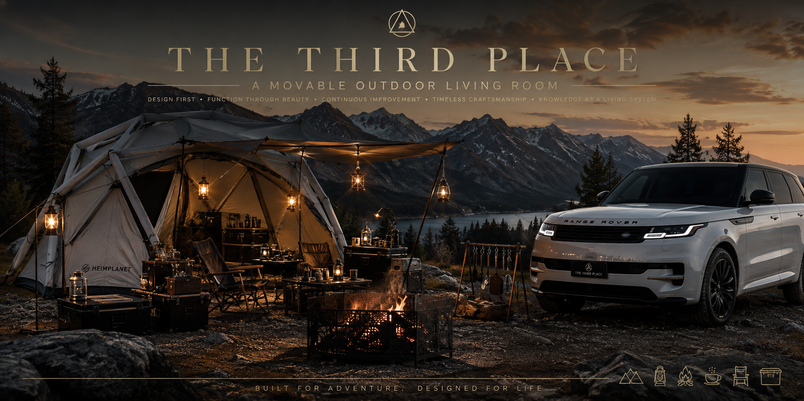

# README  
  
  
# 🏕️ THE THIRD PLACE  
  
> **A living knowledge base for designing and evolving THE THIRD PLACE.**  
  
THE THIRD PLACE は、「移動するアウトドアリビング」を実現するための設計思想・装備・知識・運用ルールを体系化したナレッジベースです。  
  
---  
  
# 📚 Repository Structure  
  
## 📜 TP — Core Documents  
  
| Document | Description |  
|----------|-------------|  
| 📖 [TP-000 Original](TP-000_Original.md) | Original Concept |  
| 🧭 [TP-001 Constitution](TP-001_Constitution.md) | Project Constitution |  
| 🎨 [TP-002 Design Bible](TP-002_Design_Bible.md) | Design Principles |  
| 🏕️ [TP-003 Field Atlas](TP-003_Field_Atlas_Landscape_Framework.md) | Field Evaluation Framework |  
| 🧰 [TP-004 Equipment Registry](TP-004_Equipment_Registry_Object_Reference.md) | Equipment Database |  
| 💰 [TP-005 Acquisition Strategy](TP-005_Acquisition_Strategy.md) | Purchase Strategy |  
| 🧭 [TP-006 Foundation Compass](TP-006_Foundation_Compass.md) | Decision Framework |  
| 🏗️ [TP-007 Habitat Architecture](TP-007_Habitat_Architecture.md) | Camp Architecture |  
| ❤️ [TP-008 Affinity Lexicon](TP-008_Affinity_Lexicon.md) | Preference Dictionary |  
| ✨ [TP-009 Aesthetic Grammar](TP-009_Aesthetic_Grammar.md) | Design Language |  
| 📦 [TP-010 Storage Blueprint](TP-010_Storage_Blueprint.md) | Storage System |  
  
---  
  
## ⚙️ PX — Project Documents  
  
| Document | Description |  
|----------|-------------|  
| 📋 [PX-001 Documentation System](PX-001_Documentation_System.md) | Documentation Rules |  
| 📝 [PX-002 Project Ledger](PX-002_Project_Ledger.md) | Conversation & Change Log |  
| 👁️ [PX-003 Vigil Protocol](PX-003_Vigil_Protocol.md) | Monitoring Protocol |  
  
---  
  
## 🔍 TM — Research Library  
  
| Document | Description |  
|----------|-------------|  
| 🏛️ [TM-001 Heritage Chronicle](TM-001_Heritage_Chronicle.md) | Brand History |  
| 🛠️ [TM-002 Atelier Discovery](TM-002_Atelier_Discovery.md) | Garage Brand Research |  
| 🌍 [TM-003 Beyond Journey](TM-003_Beyond_Journey.md) | Outdoor Inspirations |  
| 🎭 [TM-004 Cultural Reference](TM-004_Cultural_Reference.md) | Design References |  
| 🔎 [TM-005 Search Doctrine](TM-005_Search_Doctrine.md) | Research Methodology |  
  
---  
  
# 🎯 Design Philosophy  
  
THE THIRD PLACE is guided by five principles.  
  
- 🎨 Design First  
- ⚙️ Function Through Beauty  
- 🔄 Continuous Improvement  
- 🪵 Timeless Craftsmanship  
- 📚 Knowledge as a Living System  
  
---  
  
# 🗂 Repository Purpose  
  
This repository serves as the **Single Source of Truth (SSOT)** for:  
  
- 🏕️ Design Philosophy  
- 🧰 Equipment Registry  
- 🏗️ Camp Architecture  
- 📄 Documentation  
- 💰 Acquisition Strategy  
- 📚 Knowledge Management  
  
---  
  
# 🚀 Current Status  
  
| Item | Version |  
|------|---------|  
| 🧭 Constitution | Ver.3 |  
| 🎨 Design Bible | Ver.3 |  
| 🧰 Equipment Registry | Ver.4 |  
| 📄 Documentation System | Active |  
  
---  
  
# 🔒 License  
  
Private repository.  
  
All documents are maintained exclusively for the **THE THIRD PLACE** project.  
